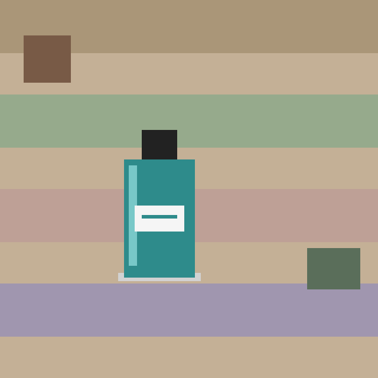
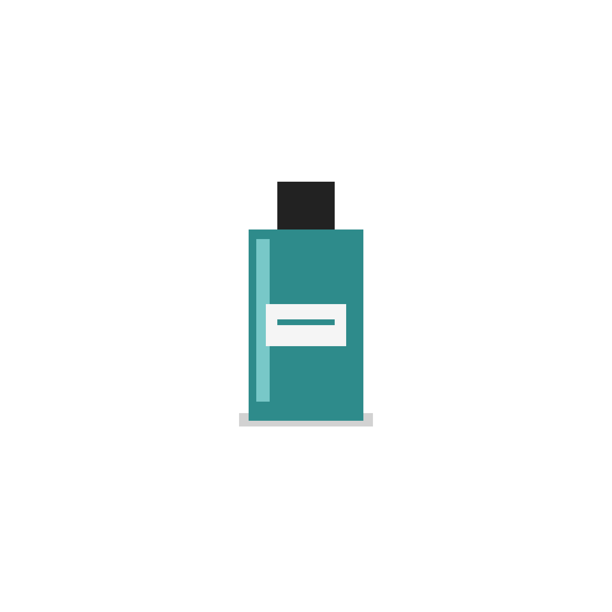

# ComfyUI E-Ticaret Görsel Pipeline'ı

ComfyUI'ı **API + WebSocket** üzerinden programatik olarak süren, e-ticaret ürün
görsellerini otomatik "stüdyo kalitesine" dönüştüren bir Node.js orchestration servisi.

> **Amaç:** Ham ürün fotoğrafı → arka plan temizleme → düz stüdyo arka planı →
> AI upscale → kaydet. Tamamı tek bir komut ya da tek bir REST çağrısıyla, hiç
> ComfyUI arayüzüne girmeden.

Bu repo, ComfyUI'ın yalnızca arayüzde değil; **headless / backend entegrasyonu**
senaryosunda nasıl otomatize edileceğini gösterir. E-ticaret panellerinden (Laravel,
Node, vb.) doğrudan çağrılabilecek şekilde tasarlanmıştır.

---

## Demo (önce / sonra)

| Ham fotoğraf (girdi) | İşlenmiş stüdyo görseli (çıktı) |
|:---:|:---:|
|  |  |
| Dağınık arka plan, merkez dışı | Temiz beyaz stüdyo + 2x upscale |

> **GPU veya ComfyUI kurulumu olmadan** çalışan, dahili bir mock ComfyUI sunucusuna
> karşı **gerçek pipeline'ı** uçtan uca koşturan bir demo dahildir:
>
> ```bash
> npm install
> npm run demo
> ```
>
> Demo; örnek bir ham ürün görseli üretir → mock ComfyUI'a yükler → workflow'u
> kuyruğa alır → WebSocket olaylarını dinler → sonucu indirip kaydeder. Yani
> `src/` altındaki orchestration kodunun gerçekten çalıştığını kanıtlar.

---

## Neyi Gösteriyor?

- **ComfyUI API formatı**na hâkimiyet — workflow graph'ı elle değil, kod ile
  (`node_id → { class_type, inputs }`) programatik olarak kuruluyor.
- **WebSocket ile canlı iş takibi** — `progress` / `executing` / `executed` /
  `execution_error` olayları dinlenip iş bitene kadar Promise olarak yönetiliyor.
- **Görsel upload / download** akışı (`/upload/image`, `/view`).
- **Batch işleme** ve **REST servisi** — gerçek üretim senaryosuna uygun mimari.
- Sıfır ağır bağımlılık: `ws`, `express`, `dotenv` dışında her şey saf Node.js.

---

## Mimari

```
                ┌─────────────────────────────────────────────┐
   ürün.jpg ──► │  ProductImagePipeline                        │
                │                                              │
                │  1. uploadImage()      ──►  POST /upload     │
                │  2. buildWorkflow()    ──►  (graph kurulur)  │
                │  3. runWorkflow()      ──►  POST /prompt      │ ──► ComfyUI
                │       └─ WebSocket ile canlı ilerleme        │ ◄──   (8188)
                │  4. fetchImage()       ──►  GET  /view        │
                └─────────────────────────────────────────────┘
                                  │
                                  ▼
                          output/urun_studio.png
```

Workflow adımları (`src/workflows/productPhoto.js`):

| Node | İşlev |
|------|-------|
| `LoadImage` | Yüklenen ürün görselini alır |
| `Image Remove Background (rembg)` | Arka planı temizler (IMAGE + MASK) |
| `GetImageSize+` | Orijinal ölçüyü okur |
| `EmptyImage` | Düz renkli stüdyo arka planı üretir |
| `ImageCompositeMasked` | Ürünü arka plan üzerine yerleştirir |
| `UpscaleModelLoader` + `ImageUpscaleWithModel` | AI ile büyütme |
| `SaveImage` | Sonucu kaydeder |

---

## Kurulum

```bash
npm install
cp .env.example .env   # Windows: copy .env.example .env
```

`.env` içinde ComfyUI sunucu adresini ayarla:

```env
COMFYUI_HOST=127.0.0.1
COMFYUI_PORT=8188
UPSCALE_MODEL=4x-UltraSharp.pth
STUDIO_BG_COLOR=FFFFFF
```

### ComfyUI tarafı gereksinimleri

Çalışan bir ComfyUI kurulumu ve şu custom node / modeller:

- **rembg node'u** — arka plan temizleme
  ([ComfyUI-rembg](https://github.com/Loewen-Hob/rembg-comfyui-node-better) veya
  WAS Node Suite). `BG_REMOVAL_CLASS` sabitini kullandığın pakete göre güncelle.
- **ComfyUI_essentials** — `GetImageSize+` node'u için.
- Bir **upscale modeli** (örn. `4x-UltraSharp.pth`) →
  `ComfyUI/models/upscale_models/` altına.

> Upscale'i kapatmak istersen `--no-upscale` bayrağını kullan; o zaman upscale
> modeli gerekmez.

---

## Kullanım

### 1) Tek görsel (CLI)

```bash
node bin/process-product.js ./input/ayakkabi.jpg
node bin/process-product.js ./input/ayakkabi.jpg --bg=F5F5F5 --no-upscale
```

### 2) Toplu işleme (batch)

```bash
# .env -> INPUT_DIR içindeki tüm görseller
npm run batch

# özel klasör + gri stüdyo arka planı
node bin/batch.js ./urunler --bg=EEEEEE
```

### 3) REST servisi (e-ticaret backend entegrasyonu)

```bash
npm run serve
# -> http://localhost:3000
```

İstek örneği (cURL):

```bash
curl -X POST "http://localhost:3000/api/process?bg=FFFFFF" \
  --data-binary "@input/ayakkabi.jpg" \
  -H "Content-Type: image/jpeg" \
  --output output/sonuc.png
```

Sağlık kontrolü:

```bash
curl http://localhost:3000/health
```

---

## Laravel'den Çağırma Örneği

E-ticaret panelinde ürün görseli yüklendiğinde bu servisi tetiklemek için:

```php
use Illuminate\Support\Facades\Http;

$processed = Http::withBody(
        file_get_contents($request->file('image')->getRealPath()),
        'image/jpeg'
    )
    ->timeout(180)
    ->post('http://localhost:3000/api/process?bg=FFFFFF');

// İşlenmiş görseli kaydet
Storage::disk('public')->put(
    "products/{$product->id}/studio.png",
    $processed->body()
);
```

---

## Programatik Kullanım (kütüphane olarak)

```js
import { ProductImagePipeline } from './src/index.js';

const pipeline = new ProductImagePipeline();
const saved = await pipeline.processFile('./input/canta.jpg', {
  bgColor: 'F5F5F5',
  upscale: true,
});
console.log('Kaydedildi:', saved);
```

---

## Proje Yapısı

```
comfyui-ecommerce-pipeline/
├─ src/
│  ├─ comfyClient.js        # ComfyUI HTTP + WebSocket istemcisi
│  ├─ pipeline.js           # Uçtan uca işleme orchestration'ı
│  ├─ server.js             # REST API (express)
│  ├─ config.js             # .env yapılandırması
│  ├─ logger.js
│  └─ workflows/
│     ├─ productPhoto.js    # Ürün fotoğrafı workflow builder
│     └─ textToImage.js     # Metin→görsel (batch) workflow builder
├─ bin/
│  ├─ process-product.js    # CLI: tek görsel
│  └─ batch.js              # CLI: klasör
├─ examples/
│  └─ workflow-product.json # API formatı örnek graph
├─ input/ · output/
└─ .env.example
```

---

## Notlar

- WebSocket olay akışı sayesinde polling yok; iş gerçekten bittiğinde
  (`executing.node === null`) Promise çözülür.
- `JOB_TIMEOUT_MS` ile uzun süren işler için güvenli zaman aşımı vardır.
- Workflow builder'lar saf fonksiyon olduğundan kolayca test edilip
  genişletilebilir (ör. logo ekleme, watermark, farklı en-boy oranları).

---

_Geliştiren: DevUps · İletişim: ai@devups.com.tr_
